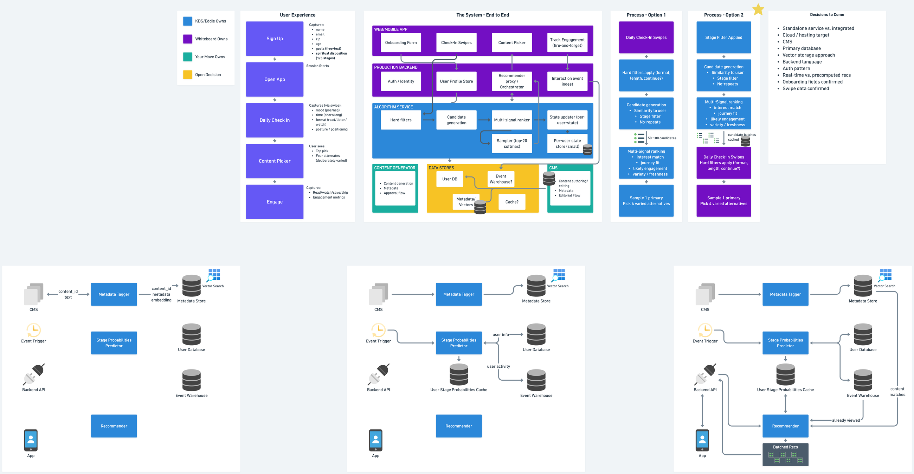

# YourMove Platform Architecture

Living documentation for the YourMove platform — a multi-vendor recommender system built in collaboration with Whiteboard (UX / frontend) and KDS / Eddie Kirkland (algorithm and microservices).

## Quick links

- [Recommender Architecture Glossary](docs/recommender-architecture-glossary.md) — definitions for every component on the architecture map
- [Visual glossary (HTML)](docs/recommender-architecture.html) — the same content with the diagram and cropped sections embedded inline (best read for first-time viewers)
- [Architecture diagram (PNG)](diagrams/recommender-architecture-diagram.png) — source artifact from the May 4–5 design sessions
- [Thread notes from May 4–5, 2026](docs/THREAD-NOTES-2026-05-05.md) — what was discussed, key decisions captured, open items

## What's in here

| Folder | Contents |
|---|---|
| `docs/` | Glossary (markdown + HTML) and session notes |
| `diagrams/` | Original architecture diagram and cropped section images |

## Diagram preview

## Updating

This is a living document. As decisions resolve, edit the markdown glossary in `docs/`, then commit and push — updates appear immediately on GitHub. The visual HTML version is regenerated from the same source content.

## Sources

- _Daily Flows and Recommendations_ — May 4, 2026, with Whiteboard (Alex Purdie, Bailey Dingley) and Alex Morrison
- _YMC / Eddie_ — May 5, 2026, microservices walkthrough with Eddie Kirkland (KDS), Alex Morrison, Suzy Gray, Allen Haynes, Tori
