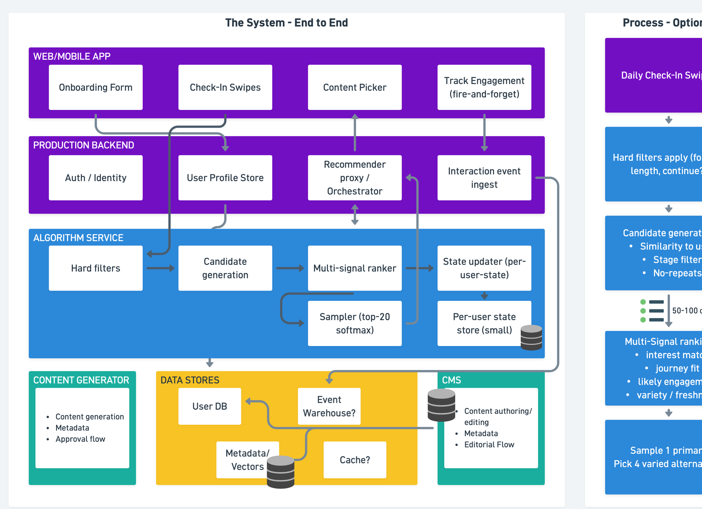
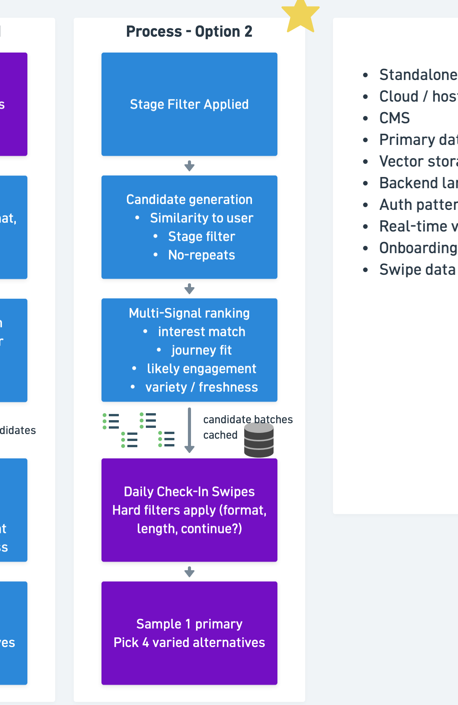
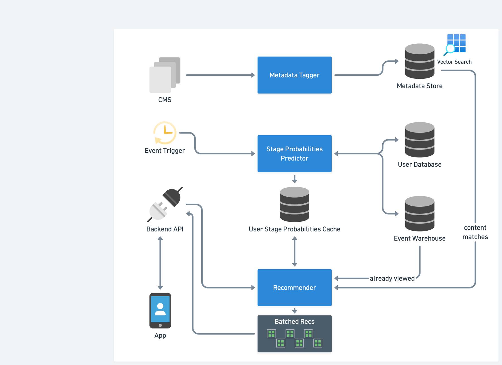
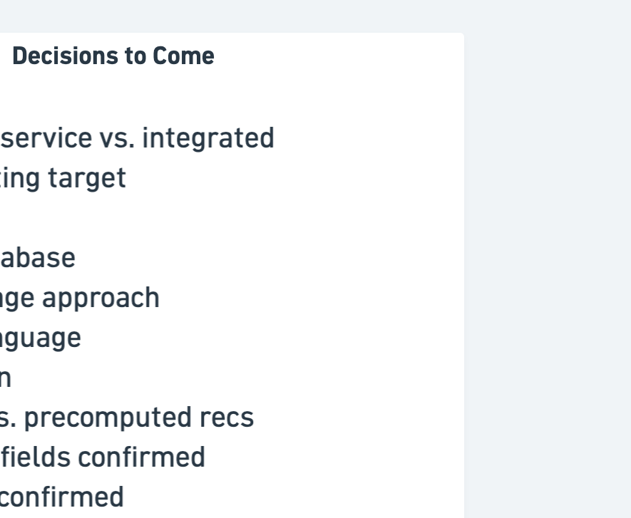

# Recommender Architecture — Component Glossary

**Source material:** "Daily Flows and Recommendations" (May 4, 2026, with Whiteboard) and "YMC / Eddie" (May 5, 2026, microservices walkthrough).
**Scope:** The System End-to-End (top center of the map), Process Options 1 & 2 (top right), and the three progressive microservice diagrams along the bottom.
**Convention:** Each entry includes a short definition, what was actually said about it on the calls (where applicable), and any open questions or flags. Items not discussed are labeled **[Not discussed in calls — standard definition]**.

**Ownership color key (from the diagram legend):**

- **Purple = Whiteboard owns** (web/mobile app, production backend, CMS interactions on the API side)
- **Blue = KDS / Eddie owns** (algorithm service, all three core microservices)
- **Teal = Your Move owns** (Content Generator, CMS as content authoring surface)
- **Yellow = Open decision** (data store choices not yet finalized)

---

## Part 1 — The System End-to-End

This is the high-level picture: every major service in the platform, grouped by the team responsible for it. The two Process Options and the three microservice diagrams further down the map are zoom-ins on the **Algorithm Service** band of this picture.

### 1.1 Web / Mobile App (Purple — Whiteboard owns)

The user-facing client. Communicates only with the Production Backend; never talks to the Algorithm Service or the data stores directly.

**Onboarding Form**
The first-run capture flow. Collects the minimum technical fields (name, email, zip, age, free-text goals, initial spiritual disposition / 1-of-5 stages) plus whatever additional questions are appropriate for the marketing hook the user came in through. Discussed at length on May 4: Alex Morrison was clear that the minimum-viable fields are a **technical floor**, not a UX target — *"we're not going for 30-second starts… we don't want cold start."* Alex Purdie's counter was the bounce-rate concern, and the team agreed there will likely be **multiple onboarding on-ramps** (e.g., happiness assessment, leadership assessment, identity assessment) that each capture a different superset of inputs but share the same minimum fields.

**Check-In Swipes**
The daily ritual. Captures four things via a swipe interface: **mood** (positive/negative), **time** available (short/long), **format** preference (read/listen/watch), and **posture/positioning** (the directional/stage signal). Designed by Whiteboard to feel "invitational and not like you're having to put in data every day," with a Likert fine-tune for users who want more precision. The output of the swipes is what the Hard Filters and stage-aware ranking key off of.

**Content Picker**
Where the user chooses what to engage with from the recommendations. Surfaces **one top pick plus four deliberately varied alternates** mapping to the three content directions (recenter / grow / express). The "four varied" framing came from Alex Purdie on May 4: *"if it's just one piece, how do I know they got this right? But if it's three pieces, you give a little more affordance."*

**Track Engagement (fire-and-forget)**
The client-side instrumentation that emits interaction events — read, watch, save, skip, dwell time, completion percentage. "Fire-and-forget" means events are dispatched asynchronously without blocking the UI. The events flow through Interaction Event Ingest into the Event Warehouse and become the substrate for both the Stage Probabilities Predictor and the no-repeats filter in the Recommender.

### 1.2 Production Backend (Purple — Whiteboard owns)

Whiteboard's server-side layer. This is the only thing the app talks to. Eddie's framing on May 5: *"the app reaches out to the backend API, which is something Whiteboard is creating. They have their whole backend process that's an API."*

**Auth / Identity**
User authentication and session management. **[Not discussed in calls — standard definition.]** The "Auth pattern" decision is still listed in the Decisions to Come panel — SSO, magic link, password, etc. is not yet chosen.

**User Profile Store**
The system of record for user account data — onboarding answers, demographics, declared goals, the user's current stage as last computed, and any profile attributes captured along the way. This is the same logical store that appears as **User Database** in the bottom microservice diagrams. Read by the Recommender Proxy when assembling a request and by the Stage Probabilities Predictor when it runs its batch update.

**Recommender Proxy / Orchestrator**
Whiteboard's internal API layer that brokers between the app and the Algorithm Service. The app does not call the recommender directly — it calls the proxy, which (a) authenticates the request, (b) assembles the user context, (c) calls the Algorithm Service for recommendations or pulls pre-staged batches from cache, and (d) returns a clean payload to the app. This is also where the choice between **standalone vs. integrated** (listed in Decisions to Come) actually lives — does the Algorithm Service run as a separate Eddie-owned service that this proxy calls, or is it co-located inside Whiteboard's backend? Eddie's plan implies standalone, since he is building the microservices to be handed off and deployed wherever Whiteboard wants them.

**Interaction Event Ingest**
The endpoint that receives Track Engagement events from the app and writes them to the Event Warehouse. Designed for high-volume, fire-and-forget writes. **[Not discussed in calls — standard definition.]**

### 1.3 Algorithm Service (Blue — KDS / Eddie owns)

This is the band that the Process Options and the bottom three diagrams zoom into. At this resolution, it is the in-request pipeline that turns *"give me recommendations for user X"* into a ranked list. The boxes shown here correspond to stages of the recommender's internal flow.

**Hard Filters**
Deterministic pass/fail rules — format match, length match, "continue where you left off" vs. brand-new content. Run early to shrink the candidate universe before expensive scoring. Same definition that appears in the Process Options.

**Candidate Generation**
Produces the working pool of items to score. Combines vector similarity (user profile vs. content metadata), stage filter (using the Stage Probabilities Cache), and no-repeats exclusion (from the Event Warehouse). Target pool size shown elsewhere on the map is **50–100 candidates**.

**Multi-Signal Ranker**
Scores the candidates against four signals: interest match, journey fit, likely engagement, and variety/freshness. Produces a ranked list. **[Exact weighting not yet defined.]**

**State Updater (per-user-state)**
A small in-pipeline component that updates short-lived per-user state during a request — for example, tracking what the user has been shown in this session so the next batch can avoid immediate repetition. Distinct from the Stage Probabilities Predictor (which runs batch in the background) and from the Event Warehouse (which is the long-term log). **[Not discussed in detail — interpretation based on diagram position.]**

**Sampler (top-20 softmax)**
The final selection step. Takes the top of the ranked list and uses a **softmax sampler over the top 20** to inject controlled randomness into which items get surfaced. The point is to avoid serving the exact same top-N to every similar user every day — the softmax weights bias toward higher-ranked items but still allow lower-ranked items to surface occasionally, which improves variety and prevents over-fitting to the model's confidence. **[Not discussed in calls — standard definition for this pattern.]**

**Per-User State Store (small)**
The short-lived persistence layer for the State Updater — recent impressions, in-session exclusions, last-served items. Sized small because it holds rolling-window data per active user, not full history. The full history lives in the Event Warehouse. **[Not discussed in calls — standard definition.]**

### 1.4 Content Generator (Teal — Your Move owns)

The pipeline that turns long-form source material (sermon transcripts, podcasts) into the smaller, modular content pieces the recommender serves. Discussed across both calls.

**Content Generation**
The AI-assisted step that takes a transcript (e.g., a 28-minute sermon) and produces multiple shorter derivatives — short reads, medium reads, long reads, and eventually audio/video clips. Tori is the operator working through these now; Alex Morrison on May 4: *"we take a 28-minute video, and really just the transcript of it, and we're saying, hey, generate, like, tell us what we can get out of this… we're kind of creating maybe eight pieces of content out of that 28-minute video."* The current approved-content count was confirmed on May 5 as roughly 37 pieces, on track for ~75.

**Metadata (Content Generator)**
The metadata-tagging step that runs **inside** the Content Generator on every piece it produces. This was the source of Alex Morrison's concern on May 5: tagging in two places (here and in the standalone Metadata Tagger) creates a consistency risk. The team resolved this by agreeing both the Content Generator and the standalone Metadata Tagger will **share the same core tagging code**, so a 0.9 score in one place means the same thing as a 0.9 in the other. Suzy's reasoning: *"that's the critical piece because it has to be consistent… does a 0.9 feel like a 0.9 when it's related to this piece of content."*

**Approval Flow**
The human-review step where Suzy / Allen / Tori review generated content and its metadata before it goes live in the CMS. Suzy on May 5: *"the thing that is so helpful about the content generator is having being able to check the metadata when I check the content."* This is why metadata tagging stays inside the Content Generator even though there's a separate tagger downstream.

### 1.5 Data Stores (Yellow — Open Decision)

The persistence layer. Yellow on the map signals these are choices not yet locked in.

**User DB**
The user data store. Same logical entity as User Profile Store above and User Database in the bottom diagrams; the diagram shows it as a separate box because the Algorithm Service reads from it directly. **Primary database** is listed in Decisions to Come.

**Event Warehouse?**
Append-only log of all user interaction events. Source for the Stage Probabilities Predictor (user activity) and the Recommender (already-viewed exclusion). The question mark on the diagram reflects that the choice of warehouse technology is unresolved — could be a data warehouse (Snowflake, BigQuery), an event store (Kafka + S3 + DuckDB), or a transactional DB with an events table. **[Listed implicitly in Decisions to Come.]**

**Metadata / Vectors**
Combined store for content metadata (structured tags, percentages by topic, format, stage applicability) and the vector embeddings used for similarity search. Same logical entity as Metadata Store in the bottom diagrams. **Vector storage approach** is listed in Decisions to Come — could be a dedicated vector DB (Pinecone, Weaviate), pgvector inside the primary DB, or vectors stored alongside metadata in the CMS.

**Cache?**
A general-purpose cache layer. The question mark indicates this is conditional — it's required if Whiteboard chooses to deploy Process Option 2 (precomputed batched recs) but is optional if the system runs in pure real-time mode. Eddie on May 5: *"in theory, this could happen in real time, or it could happen as a back-end process, like we could store this in a queue waiting for them as well. So that's a Whiteboard decision of what they want to do in terms of how they want to stage this."*

### 1.6 CMS (Teal — Your Move owns)

**CMS — Content authoring / editing / Metadata / Editorial Flow**
The Content Management System that holds all published content. Confirmed on May 5 as **Sanity**. This is where Your Move's editorial team works directly with content (writing, editing, scheduling). It's also the upstream trigger for the standalone Metadata Tagger — when content lands or changes in the CMS, the tagger runs. The CMS also receives metadata back from the tagger so editors can review and adjust tags without leaving their authoring environment. The **CMS** itself is also listed in Decisions to Come, but the May 5 call moved the answer toward Sanity in practice.

---

## Part 2 — Process Options 1 & 2

These two columns describe the same end goal — pick one primary recommendation plus four varied alternatives — but they differ in **when** the heavy work runs and **where** the user's daily check-in swipes sit in the pipeline.

### 2.1 How they differ at a glance

- **Option 1 (purple, Whiteboard-owned framing):** Real-time flow. The user's daily check-in swipes come **first**, and candidate generation + ranking run **after** the swipes. The recommender does its work while (or just after) the user is interacting.
- **Option 2 (blue, KDS/Eddie-owned framing):** Batched / pre-computed flow. The stage filter is applied **upfront** in the background, candidate batches are **cached** before the user shows up, and the daily check-in swipes then act as a final filter against those pre-staged batches. Eddie on May 5: *"the recommender isn't just recommending five things, it's recommending eight batches of five things… so that no matter what, while the user is doing their daily check-in, we can be serving up these different batch recommendations."*

The starred Option 2 reflects the direction Eddie is leaning. He noted that real-time is the engineering target, and staged caching is an optimization on top of it: *"we don't want to rely on it being staged, we want to make sure we engineer the system so that it can perform in real time. And then if we want to start optimizing it by staging it in a cache, we can do that."*

### 2.2 Option 1 — Boxes (top to bottom)

**Daily Check-In Swipes**
The user-facing daily ritual. Captures mood, time, format, and posture/positioning. In Option 1, these swipes are the **first** thing that runs — they feed directly into the hard filters below.

**Hard filters apply (format, length, continue?)**
Deterministic pass/fail rules that reduce the content universe to only items the user could plausibly consume right now: format match, time-budget match, and continue-vs-new branching. **[Specific rules not detailed in calls — standard definition.]**

**Candidate generation — Similarity to user / Stage filter / No-repeats**
Produces a working pool of roughly **50–100 candidate items**. Three signals narrow the pool: (1) **similarity to user** — vector match between user profile and content metadata; (2) **stage filter** — only pulls content tagged for the stages the user is currently weighted toward; (3) **no-repeats** — excludes anything the user has already seen, sourced from the Event Warehouse. Eddie on May 5: *"we don't want to serve them stuff they've already seen before in the past."*

**Multi-Signal ranking — interest match / journey fit / likely engagement / variety / freshness**
Scores the 50–100 candidates and ranks them. Four signals: interest match, journey fit (against stage probabilities), likely engagement (predicted consume / save / not-skip probability), and variety / freshness. **[Exact weighting not yet defined.]**

**Sample 1 primary / Pick 4 varied alternatives**
Final selection — one primary recommendation plus four deliberately varied alternates spanning the three content directions (recenter / grow / express).

### 2.3 Option 2 — Boxes (top to bottom)

**Stage Filter Applied**
Runs **upfront in the background** (e.g., the 2 a.m. job Eddie described). Uses the user's most recent stage probability vector from the User Stage Probabilities Cache to decide which stages to draw content from for this user's pre-staged batches.

**Candidate generation → candidate batches cached**
Same three filters as Option 1, but the output is a **set of candidate batches written to a cache** rather than a single 50–100 pool generated on demand. Several plausible candidate sets are pre-computed and stored, so any combination of the user's eventual swipe answers can be served immediately.

**Multi-Signal ranking**
Identical signals to Option 1, but pre-computed against the cached candidate batches. Result is a set of **ranked batches** ready to serve, indexed by the swipe combinations they correspond to. Eddie's framing: *"the recommender isn't just recommending five things, it's recommending eight batches of five things."*

**Daily Check-In Swipes / Hard filters apply**
In Option 2 the swipes run **after** the heavy lifting. Their job is to act as a final lookup key: based on what the user swiped, pick the matching pre-staged batch.

**Sample 1 primary / Pick 4 varied alternatives**
Same final step as Option 1. The benefit of Option 2 is latency: *"by the last swipe, it has something it's ready to go… if the recommender is not responding, there's at least recommendations ready to go."*

### 2.4 Trade-offs to weigh between the two options

- **Latency:** Option 2 is faster at the moment of user interaction; Option 1 has more freshness because everything is computed against the user's most recent state.
- **Compute cost:** Option 2 spends compute on users who may never log in that day; Option 1 spends compute only on active users but spends it under a real-time SLA.
- **Resilience:** Option 2 degrades more gracefully — if the recommender is slow or down, the cached batches are still usable.
- **Complexity:** Option 2 introduces a cache layer and a key-design problem (how do swipe combinations map to cached batches?). Option 1 is structurally simpler.
- **Eddie's stated direction:** Engineer for real-time first, then layer caching as an optimization. This suggests building Option 1's logic and treating Option 2 as a deployment pattern on top of the same recommender.

---

## Part 3 — The Three Microservices

This part defines every component shown in the bottom microservice diagram. Eddie's framing on May 5: *"I need to build out three key components to this system, and they're three microservices. A metadata tagger, a stage probability predictor, and the recommender. They all work in different lanes."* Each is fault-tolerant in isolation and can be deployed wherever Whiteboard hosts their backend.

### 3.1 Inputs and stores

**CMS (Content Management System)**
The system Whiteboard maintains where content is authored, edited, and published. Confirmed on May 5 as **Sanity**. Upstream source for the Metadata Tagger — when content lands or changes in the CMS, the tagger fires.

**User Database**
Source of truth for user account data — identity, onboarding inputs, profile attributes. Same logical store as User Profile Store / User DB in the End-to-End view.

**Event Warehouse**
Append-only store of user interaction events. Feeds the Stage Probabilities Predictor (to update probabilities) and the Recommender (for the no-repeats / "already viewed" filter).

**Metadata Store (with Vector Search)**
Where the Metadata Tagger writes its output. Stores both the structured metadata and the vector embeddings used by similarity search. Same logical store as Metadata / Vectors in the End-to-End diagram. **[Specific vector DB not yet decided.]**

**User Stage Probabilities Cache**
The persisted output of the Stage Probabilities Predictor — a per-user table holding the current five-stage probability vector, with lineage over time. Eddie called this the **source of truth** for a user's current state: *"that cache becomes kind of a source of truth"* and *"we would track lineage of that over time."* The Recommender reads from this cache; it does not recompute probabilities at request time.

**Batched Recs**
The output store for pre-computed recommendation batches. Eddie's framing: *"the recommender isn't just recommending five things, it's recommending eight batches of five things… they're going to share elements… but maybe it's a different item that's highlighted as the featured content."* The Backend API reads from this store when the app requests recommendations.

### 3.2 The three microservices

**Metadata Tagger** *(microservice, KDS / Eddie owns)*
Takes a `content_id` and the raw `text` of a piece of content, returns structured metadata plus an embedding written to the Metadata Store. Eddie: *"build a really simple [service] for taking in a content ID and text and spitting out metadata… it just takes in information from the CMS and spits out metadata."* Shares its core tagging logic with the Content Generator so metadata is consistent whether content is AI-generated or hand-authored.

**Stage Probabilities Predictor** *(microservice, KDS / Eddie owns)*
Outputs the user's current probability distribution across the five stages — five numbers that sum to 1, representing the likelihood the user is in each stage on any given day. Implements the **Markov chain** model (formerly called "user journey assessor" internally). Eddie: *"five probability numbers that would all add up to one… what's the likelihood that we're going to serve them content from this threshold."* Pulls profile data from the User Database and interaction data from the Event Warehouse, writes the result to the User Stage Probabilities Cache. Runs on an Event Trigger (scheduled / batch — *"this isn't happening when the user logs in… this happens in the back end, like this could happen at two o'clock in the morning"*), and only updates probabilities for users who have been active since the last run.

**Recommender** *(microservice, KDS / Eddie owns)*
On request from the Backend API, the Recommender (1) reads the user's stage probability vector from the User Stage Probabilities Cache, (2) reads the "already viewed" set from the Event Warehouse, (3) queries the Metadata Store via vector search for content matches that fit the user's profile and stage weighting, (4) applies the multi-signal ranking, and (5) writes a set of pre-staged batched recommendations into the Batched Recs store for the app to consume. Eddie: *"based on what we know here about the probabilities, and based on what we know about the user, which batches of content do we want to serve."*

### 3.3 Other elements on the diagram

**Event Trigger**
A scheduled or event-driven job that wakes up the Stage Probabilities Predictor.

**Backend API**
Whiteboard's API layer that the user-facing app calls. Same as the Recommender Proxy / Orchestrator from the End-to-End diagram, viewed from the recommender's side.

**App**
The user-facing client. Only touches the Backend API.

### 3.4 Data flows on the diagram

- **user info (User Database → Predictor)** — Stable profile attributes feeding the Markov chain calculation.
- **user activity (Event Warehouse ↔ Predictor)** — The interaction stream (views, swipes, saves, skips, dwell time). Bidirectional because the predictor reads activity and the system continues to write activity from the app side.
- **content matches (Metadata Store → Recommender)** — The candidate pool returned by vector similarity search against the Metadata Store, scoped by the stage filter. Input to the multi-signal ranking step.
- **already viewed (Event Warehouse → Recommender)** — The exclusion list. Implements the no-repeats filter.

---

## Part 4 — Open Items and Decisions to Come

These map directly to the **Decisions to Come** panel on the diagram plus other unresolved items from the calls.

- **Standalone service vs. integrated.** Whether the Algorithm Service runs as separate Eddie-owned microservices that Whiteboard's backend calls, or whether they get co-located. Eddie's plan implies standalone.
- **Cloud / hosting target.** Not yet chosen.
- **CMS.** Sanity referenced on May 5; not formally locked in.
- **Primary database.** Not chosen.
- **Vector storage approach.** Dedicated vector DB vs. pgvector vs. CMS-embedded — open.
- **Backend language.** Not chosen.
- **Auth pattern.** Not chosen.
- **Real-time vs. precomputed recs.** Eddie's direction is real-time first, cache as optimization. Whiteboard hasn't committed.
- **Onboarding fields confirmed.** Active discussion topic — minimum-viable floor vs. richer onboarding for personalization. Not finalized.
- **Swipe data confirmed.** The four swipe dimensions (mood, time, format, posture) are working assumptions, not formally locked.
- **Bundles vs. individual content as the recommendable unit.** Eddie flagged this on May 5 as the most pressing alignment item: *"if I'm designing for unique pieces of content and Whiteboard is designing for bundles, we got to align on that."*
- **Sequencing within a bundle.** Whether bundles are curriculum-style (ordered) or pick-any (unordered). Suzy and Allen pushed back on assuming sequential.
- **Stage definitions.** The five stages are referenced but not enumerated in either call. Worth documenting as a sibling reference.
- **Cold-start handling.** Alex on May 5: *"we don't want cold start."* Eddie's fallback is pseudo-random with stage filter when minimal data is available.
- **Two places generating metadata.** Resolved — both Content Generator and standalone Metadata Tagger will share the same core tagging code so outputs stay consistent.
- **Event Warehouse schema.** Event types are implied (view, save, skip, swipe, completion %) but not formally specified.

---

## Appendix — Quick Reference Table

| Component | Section | Owner | Purpose | Real-time or batch? |
|---|---|---|---|---|
| Onboarding Form | Web/Mobile App | Whiteboard | First-run user capture | Real-time |
| Check-In Swipes | Web/Mobile App | Whiteboard | Daily mood/time/format/posture | Real-time |
| Content Picker | Web/Mobile App | Whiteboard | Top pick + 4 alternates | Real-time |
| Track Engagement | Web/Mobile App | Whiteboard | Fire-and-forget event emission | Real-time |
| Auth / Identity | Production Backend | Whiteboard | User authentication | Real-time |
| User Profile Store | Production Backend | Whiteboard | User data system of record | — |
| Recommender Proxy / Orchestrator | Production Backend | Whiteboard | Brokers app ↔ algorithm service | Real-time |
| Interaction Event Ingest | Production Backend | Whiteboard | Receives engagement events | Real-time |
| Hard Filters | Algorithm Service | KDS / Eddie | Pass/fail rules on format, length, continue | Real-time |
| Candidate Generation | Algorithm Service | KDS / Eddie | Narrow content universe to 50–100 | Real-time or batch |
| Multi-Signal Ranker | Algorithm Service | KDS / Eddie | Score and rank candidates | Real-time or batch |
| State Updater | Algorithm Service | KDS / Eddie | Update per-user session state | Real-time |
| Sampler (top-20 softmax) | Algorithm Service | KDS / Eddie | Final 1 primary + 4 alternates with controlled randomness | Real-time |
| Per-User State Store | Algorithm Service | KDS / Eddie | Short-lived rolling state | — |
| Content Generation | Content Generator | Your Move | Long-form → modular content | Editorial |
| Metadata (Content Generator) | Content Generator | Your Move | In-line metadata tagging at content creation | Editorial |
| Approval Flow | Content Generator | Your Move | Human review of content + metadata | Editorial |
| User DB | Data Stores | Open | Profile / onboarding inputs | — |
| Event Warehouse | Data Stores | Open | Append-only interaction log | Real-time write |
| Metadata / Vectors | Data Stores | Open | Content tags + embeddings | — |
| Cache | Data Stores | Open | Optional pre-staged recs / hot data | — |
| CMS (Sanity) | CMS | Whiteboard / Your Move | Content authoring & editorial | Editorial |
| Metadata Tagger | Microservices | KDS / Eddie | content_id + text → metadata + embedding | Event-driven |
| Event Trigger | Microservices | KDS / Eddie | Wakes the predictor on schedule | Batch (e.g., 2 a.m.) |
| Stage Probabilities Predictor | Microservices | KDS / Eddie | Markov chain over 5 stages | Batch |
| User Stage Probabilities Cache | Microservices | Shared | Per-user stage vector + lineage | — |
| Backend API | Microservices | Whiteboard | Sole entry point for the app | Real-time |
| Recommender | Microservices | KDS / Eddie | Ranked recs given user state + content | Real-time, output cacheable |
| Batched Recs | Microservices | Shared | Pre-staged rec batches per user | — |
| App | Microservices | Whiteboard | Web/mobile client | Real-time |
